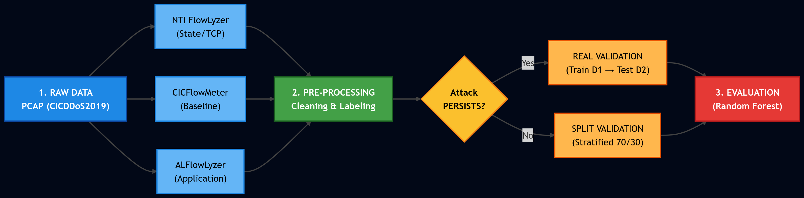

# DDoS Feature Engineering Benchmark



This repository contains the source code for the paper **"The Impact of Feature Engineering on Data Quality: A Comparative Study of Extractors for DDoS Detection"**, submitted to SBRC 2026.

## 📌 Overview
We benchmark three feature extractors using the CICDDoS2019 dataset to evaluate how Transport Layer (L4) and Application Layer (L7) features impact Machine Learning detection models.
1. **CICFlowMeter** (Baseline / Java / Volumetric)
2. **NTLFlowLyzer** (Network & Transport Layer / Python / Stateful)
3. **ALFlowLyzer** (Application Layer / Python / Semantic)

## 🚀 Key Contributions
* **Topological Labeling:** We discarded corrupted metadata and implemented a strict Ground Truth correction based on network topology (Source IP `172.16.0.5` = Attack).
* **Hybrid Validation:** Proves baseline data leakage by splitting validation into Temporal Generalization (Real) and Statistical Split.
* **Protocol Blindness:** Demonstrates the failure of modern stateful extractors when dealing with pure stateless volumetric attacks (UDP Floods).

## 📂 Directory Structure
To reproduce this experiment, ensure your directory matches this tree:

```text
ddos-benchmark/
├── data/
│   ├── raw/PCAP/            <-- Drop original CICDDoS2019 PCAPs here
│   ├── interim/             <-- Raw CSVs from extractors will be saved here
│   └── processed/           <-- Cleaned, labeled, and ML-ready CSVs
├── results/
│   └── figures/             <-- Confusion matrices and diagrams
├── src/
│   ├── extraction/          <-- L4 and L7 wrappers
│   ├── preprocessing/       <-- Topological labelers and sanitizers
│   └── analysis/            <-- Random Forest benchmark
├── README.md
└── requirements.txt
```

## 🔧 Step-by-Step Reproduction Guide

**1. Environment Setup**
Install dependencies. *Note: You must have `ntlflowlyzer` and `alflowlyzer` binaries installed and available in your system PATH.*

```bash
pip install -r requirements.txt
```

**2. Data Acquisition**
Download the original CICDDoS2019 PCAP files and place them inside `data/raw/PCAP/` preserving the day-based folders (e.g., `01-12/` and `03-11/`).

**3. Feature Extraction**
Run the wrappers to slice PCAPs and extract raw features in parallel.

```bash
python src/extraction/ntl_wrapper.py
python src/extraction/al_wrapper.py
```

**4. Preprocessing & Ground Truth Correction**
Sanitize the raw outputs and apply topological labeling.

```bash
python src/preprocessing/topological_labeler.py
python src/preprocessing/al_labeler.py
```
*(Copy the baseline CICFlowMeter CSVs directly to `data/processed/CIC/` if already extracted).*

**5. Benchmark Execution**
Run the Random Forest analysis to output F1-Scores and generate Confusion Matrices.

```bash
python src/analysis/run_benchmark.py
```

## 📄 License
MIT License.
